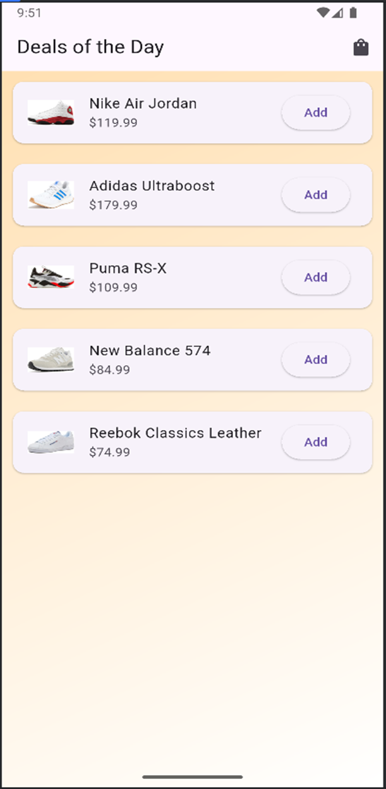
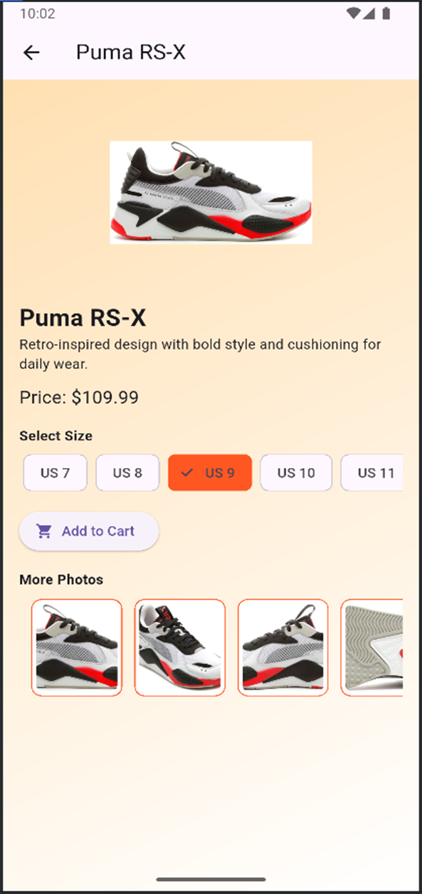
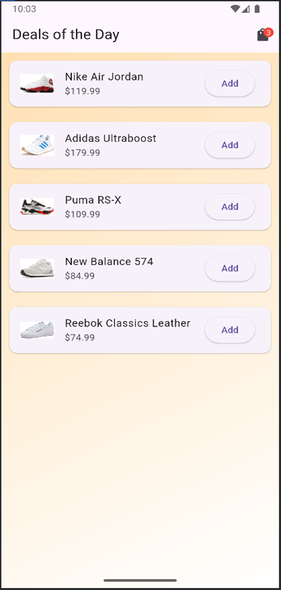
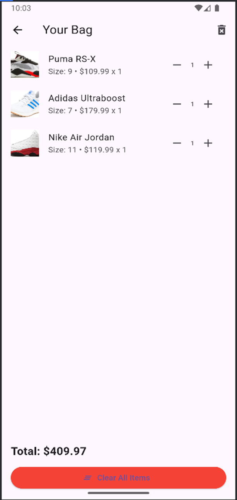

This Flutter project is a shopping app that lets users:
•	Browse a selection of shoes (stored in a local list)
•	View shoe details with extra images and description
•	Select a shoe size before adding to cart
•	Manage cart: increase/decrease quantity, remove items
•	Clear entire cart with one click
•	Cart badge displays number of unique item+size combinations
•	Smooth animations for transitions and image previews

lib/
├── main.dart
├── models/
│   ├── item.dart             # Shoe item model
│   └── cart_item.dart        # Cart entry with selected size
├── screens/
│   ├── home.dart      # Product list, badge, navigation
│   ├── shoe_detail_screen.dart # Details + size picker + image carousel
│   └── cart.dart      # Cart UI, quantity control, clear all
└── widgets/
    └── item_card.dart        # Reusable card UI for product list

assets/
└── Shoes1
└── Shoes2
└──Shoes3
└──Shoes4
└──Shoes5       # All product images grouped by shoes
How to Configure and Run
1.	Clone or download this Flutter project
2.	Make sure Flutter is installed (flutter doctor)
3.	Run this in the terminal:

flutter pub get
flutter run

You can also connect a real Android device (via USB and enable developer mode) or run an emulator.

Build APK
To generate a release APK:

flutter build apk –release

You’ll find the APK at:
build/app/outputs/flutter-apk/app-release.apk

GitHub Version Control Setup (Optional)
1.	In Android Studio:
VCS > Enable Version Control > Git
2.	Commit your code.
3.	Create a repo on GitHub, then run:

git remote add origin https://github.com/yourusername/flutter-shop-app.git
git push -u origin main

Screenshots

•	🏠 Home Screen

 

•	👟 Product Detail

 

•	🔢 Size & Quantity

 

•	🛒 Cart Screen

 

📄 License
This project is licensed under the MIT License. You are free to:
•	Use, copy, modify, merge, publish, distribute, sublicense, and/or sell copies of the software
•	Use it for both personal and commercial purposes
Please include proper attribution and retain this license notice in any copies.

MIT License
Copyright (c) 2025 [Vinit Panchal]
Permission is hereby granted, free of charge, to any person obtaining a copy
of this software and associated documentation files (the "Software"), to deal
in the Software without restriction...

🙏 Acknowledgements
This project is made possible by the following open-source tools and platforms:
•	Flutter – UI toolkit from Google for building natively compiled applications
https://flutter.dev
•	Dart Language – Optimized programming language for UI
https://dart.dev
•	Android Studio – Development IDE used to build and test this app
https://developer.android.com/studio
•	Open Source Community – For plugins, libraries, tutorials, and examples that helped shape this project
⚠️ All shoe images used in this project are for educational/demo purposes only. Please ensure you have the rights to use any real brand assets if republishing or commercializing.
